# Ceará Transparente — Pipeline de Dados (Lakehouse)

<div align="center">
  
  
  
  <br><br>
  
  
  
  
  
  <br><br>
  
  
  
  
  
  
  
</div>
<br>

<div align="center">
  <a href="https://github.com/jaimejrs/data-engineering-lab-PY03/actions/workflows/ci.yml">
    
  </a>
</div>
<br>

Pipeline de dados de **transparência pública do Ceará** (contratos + empenhos), em
arquitetura **medalhão (Bronze → Silver → Gold)** que evoluiu de um *data lake* para um
**lakehouse**: Silver e Gold são tabelas **Apache Iceberg** sobre HDFS, com um catálogo
único (**Hive Metastore**) compartilhado por **Spark** (escrita da Silver) e **Trino**
(transformação/serving da Gold via **dbt**), orquestrados de ponta a ponta pelo
**Airflow**. O warehouse Iceberg é fisicamente separado por propósito — schemas
`gold` (dimensional, consumo), `ml` (scores/previsões dos modelos) e `audit`
(reconciliação, observabilidade de infra e auditoria de acesso) — e todo o
ciclo é validado automaticamente por **CI/CD** (GitHub Actions) a cada push.


`Fases 1, 2 e 3 concluídas de ponta a ponta (Bronze → Silver → Gold → ML/IA, automáticas)` · Última atualização: 28/07/2026

> Diagrama completo de arquitetura (fluxo de dados, orquestração e infraestrutura):
> [`documentacao/diagrama-arquitetura.md`](documentacao/diagrama-arquitetura.md).
> Guia de acesso a cada aplicação do projeto (Airflow, Trino, HDFS, MLflow,
> Jupyter): [`documentacao/guia-de-exploracao.md`](documentacao/guia-de-exploracao.md).

<p align="center">
  
</p>

## Visão geral

Duas fontes, sem trilha de auditoria nem chave confiável, viram uma base analítica
testável e versionada:

- **API REST do Ceará Transparente** — contratos públicos, com paginação.
- **PostgreSQL de origem** — `empenhos`, `ordem_bancaria_orcamentaria` (filtradas por
  data) e `unidade_gestora` (tabela de referência, completa a cada execução).

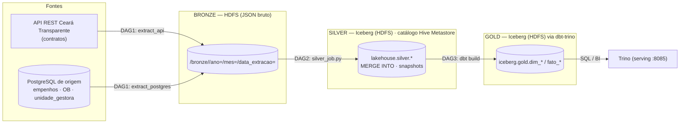

As quatro DAGs rodam **encadeadas por Dataset** (não por horário fixo) e disparam
sozinhas todos os dias — a cadeia completa `bronze → silver → gold → ml_inference` foi
validada rodando sem intervenção manual. Detalhes de arquitetura e das decisões técnicas em
[`documentacao/lakehouse-spark-iceberg.md`](documentacao/lakehouse-spark-iceberg.md) e
[`documentacao/gold-dbt-trino.md`](documentacao/gold-dbt-trino.md).

## Camadas

| Camada | Formato | Engine de escrita | Onde | Observação |
|---|---|---|---|---|
| **Bronze** | JSON bruto | Python (`src/extractors`) via WebHDFS | HDFS `/bronze` | zona raw imutável; particionada `ano=/mes=/data_extracao=` |
| **Silver** | **Iceberg** (Parquet) | **PySpark** (`src/spark_jobs/silver_job.py`) | HDFS `/warehouse/silver.db` | normalização + dedup **entre execuções** via `MERGE INTO` |
| **Gold** | **Iceberg** (Parquet) | **Trino** via **dbt** (`dbt/`) | HDFS `/warehouse/gold.db` | modelo estrela declarativo + testes dbt |
| **ml** / **audit** | **Iceberg** (Parquet) | Python (`models/`, coletores em `deploy/server-lakehouse/`) + dbt (reconciliação) | HDFS `/warehouse/{ml,audit}.db` | schemas físicos próprios (26/07/2026) — scores/previsões de ML separados de reconciliação, métricas de infra e auditoria de acesso, mesmo catálogo `iceberg` |

**Volumes reais validados (28/07/2026, consulta direta via Trino):** `empenhos` 1.376.379 ·
`ordem_bancaria_orcamentaria` 1.399.810 · `contratos` 216.358 · `unidade_gestora` 5.011 na
Silver; na Gold, `fato_empenho` 1.376.379 · `fato_contrato` 216.358 · `fato_ordem_bancaria`
1.399.810 · `dim_credor` 10.637 (**SCD2**) · `dim_orgao` 5.011 · `dim_tempo` 1.584 ·
`dim_modalidade` 21. Testes dbt: **62 no total** (32 nas colunas dos modelos da Gold, 20 nas
fontes Silver/ml/audit, 10 testes singulares de regra de negócio), todos rodando de verdade em
CI a cada push (ver seção "CI/CD" abaixo) — não só validados manualmente. Catálogo completo,
teste a teste: [`documentacao/testes-dbt.md`](documentacao/testes-dbt.md).

## Estrutura de diretórios

```
.
├── dags/                        # Airflow — 4 DAGs encadeadas por Dataset
│   ├── dag_bronze_extract.py    #   DAG 1: extract_api + extract_postgres + validate + watermark
│   ├── dag_silver_transform.py  #   DAG 2: dispara silver_job.py (Spark) via DockerOperator
│   ├── dag_gold_load.py         #   DAG 3: dispara dbt build (Trino) via DockerOperator
│   ├── dag_ml_inference.py      #   DAG 4: Modelo 1 + Modelo 2 + refresh de fato_contrato
│   └── common.py                #   constantes/Datasets compartilhados entre DAGs
├── src/
│   ├── extractors/              # Bronze — API paginada, Postgres em chunks, escrita WebHDFS
│   ├── transformers/            # regras de normalização/dedup compartilhadas (rules.py) e Silver legada (pandas)
│   ├── spark_jobs/               # Silver real do lakehouse — Bronze -> Iceberg (MERGE INTO)
│   └── validators/              # validação de schema/completude da Bronze
├── dbt/                          # Gold declarativa — staging -> dims -> fatos + testes (dbt-trino)
├── models/                       # Fase 3 (ML/IA) — Modelo 1 (anomaly_detection.py) e Modelo 2 (payment_forecast.py)
├── streamlit/                    # painel de negócio (Docker próprio) — consome iceberg.gold/ml via Trino
│   │                             #   hospedado publicamente via Tailscale Funnel (sem VPN, diferente do resto)
│   ├── tabs/                     #   Visão Geral, Previsão de Pagamentos, Anomalias em Contratos, Resumo (IA)
│   └── tests/                    #   smoke test (AppTest, Trino mockado) — job streamlit-smoke no CI
├── docker/                       # Dockerfiles do stack (airflow, spark, hive, trino, superset)
├── deploy/server-lakehouse/      # overlay aditivo do lakehouse no servidor real do time
│   │                             #   (auto-sync.py: deploy pull-based via cron + Checks API;
│   │                             #   maintenance.sh: compaction/expiração/retenção do Iceberg;
│   │                             #   collect_infra_metrics.py / collect_access_audit.py: schema audit)
├── .github/workflows/ci.yml      # CI (6 jobs) + CD (deploy via SSH/Tailscale) — ver seção "CI/CD"
├── documentacao/                 # documentação técnica de entrega (arquitetura, dicionário de dados)
├── imgs/               # screenshots/diagrama usados neste README (apresentação em si foi descontinuada)
├── notebooks/                    # exploração de ingestão + EDA Bronze/Silver/Gold + treino/avaliação ML
├── tests/                        # pytest — extractors, validators, transformers, modelos de ML
├── apresentacao/                 # rascunho de apresentação HTML (git-ignorada)
├── .env / .env.example
└── requirements.txt
```


## Infraestrutura (Docker)

`docker-compose.yml` na raiz sobe o stack completo: PostgreSQL (metadados do Airflow +
DB `metastore`), Hadoop (NameNode + DataNode), Airflow (imagem custom com Java +
`pyspark` + providers `apache-spark`/`docker`), Jupyter, e o cluster do lakehouse —
**Spark** (master + worker), **Hive Metastore** e **Trino**.

```bash
docker compose up -d --build
```

Acesse Airflow em `http://localhost:8080` (usuário/senha criados por `airflow-init`:
`admin`/`admin`), o HDFS em `http://localhost:9870`, a UI do Spark master em
`http://localhost:8081` e o Trino em `http://localhost:8085`. `SOURCE_POSTGRES_URL`
(banco de origem) é externo a este compose — ver `.env.example`.

> No servidor real do time a topologia é diferente do compose da raiz (serviços
> pré-existentes do curso + um **overlay aditivo** só com os 4 serviços do lakehouse) —
> ver [`deploy/server-lakehouse/`](deploy/server-lakehouse/).

> Se o build falhar com erro de DNS (`Temporary failure in name resolution`) em um host
> com egress restrito para as redes bridge do Docker, ver `docker/airflow/README.md`.

## Orquestração — Airflow

As 4 DAGs rodam encadeadas por **Dataset** (o Airflow dispara a próxima assim que a
anterior emite o seu, em vez de depender de um horário fixo que poderia rodar cedo
demais):

| DAG | Gatilho | O que faz |
|---|---|---|
| `bronze_extract` | `@daily` | API + Postgres → Bronze, valida, avança watermark (com lookback configurável). Emite `bronze://validated`. |
| `silver_transform` | Dataset `bronze://validated` | `silver_job.py` via `DockerOperator` (imagem `datalab-spark`, `spark-submit local[*]`). Emite `silver://ready`. |
| `gold_load` | Dataset `silver://ready` | `dbt build` via `DockerOperator` (imagem `datalab-dbt`) — 32 nós: modelos + snapshot SCD2 + testes. Emite `gold://ready`. |
| `ml_inference` | Dataset `gold://ready` | Modelo 1 + Modelo 2 + relatório narrativo (`PythonOperator`, direto na imagem do Airflow) + `dbt build --select fato_contrato` (`DockerOperator`) para o score de anomalia aparecer no fato na mesma execução. |

O cluster Spark standalone (`spark-master`/`worker`) fica reservado para **backfills
manuais pesados** (validado processando os 1,38M de empenhos do histórico completo).

> A DAG `ml_inference` (4 tasks: `score_anomalias`, `prever_pagamentos`,
> `refresh_fato_contrato`, `gerar_relatorio_narrativo`) está **validada de
> ponta a ponta no Airflow real do servidor (25/07/2026)** — cadeia completa
> `bronze_extract → silver_transform → gold_load → ml_inference` disparada do
> zero e concluída sozinha, sem intervenção manual, em ~5 minutos.
> `score_anomalia_contrato` e `fato_contrato.score_anomalia` ficaram
> 215.839/215.839 preenchidos (100% de cobertura de join), e o relatório
> narrativo foi gerado com qualidade real via API OpenAI. Ver
> [`documentacao/diagrama-arquitetura.md`](documentacao/diagrama-arquitetura.md)
> para o diagrama completo de orquestração/infraestrutura.

## CI/CD

[](https://github.com/jaimejrs/data-engineering-lab-PY03/actions/workflows/ci.yml)

Todo push roda `.github/workflows/ci.yml` — **6 jobs de CI** em paralelo (lint/formatação
via `ruff`, testes unitários, smoke test do painel Streamlit (`AppTest`, Trino mockado),
Spark local + Iceberg validando o `MERGE INTO`, `dbt parse`, e `dbt build` real contra um
Trino + Iceberg + Hive Metastore efêmero em Docker, sem HDFS)
— seguidos, só em push na `main` e só se os 6 passarem, de um **job de deploy (CD)**: entra
na rede privada do servidor via Tailscale e aplica o código real por SSH (chave dedicada,
restrita no servidor a rodar só o script de deploy). Existe também uma segunda camada de
CD, mais simples e independente — `auto-sync.py` via cron no servidor, a cada 15min, que só
aplica se a Checks API do GitHub mostrar CI verde — como rede de segurança caso o job do
GitHub Actions falhe. Detalhes de cada job, decisões de design e o porquê de cada trade-off
em [`stacks/github-actions-cicd.md`](stacks/github-actions-cicd.md) (interno).

## Observabilidade e auditoria

Painéis operacionais em **Apache Superset** (`docker/superset/`) cobrindo saúde do próprio
pipeline — cargas e qualidade Bronze→Silver→Gold, execuções do Airflow (sucesso/falha por
DAG e task), métricas de infraestrutura (CPU/memória/disco por container) e auditoria de
acesso (sessões SSH e comandos executados, inclusive via `sudo`) — coletadas a cada 5min por
scripts em `deploy/server-lakehouse/` e gravadas como tabelas Iceberg no schema `audit`.
Existe porque múltiplas pessoas do time compartilham acesso à mesma infraestrutura de
produção — dá para responder "quem fez o quê" sem vasculhar log manualmente. Retenção de
dado sensível (IP, comando completo) limitada via `maintenance.sh` (`AUDIT_RETENTION_DAYS`,
padrão 90 dias), que também cuida de compaction e expiração de snapshot do Iceberg.

## Configuração

Copie `.env.example` para `.env` e ajuste os valores.

| Variável | Descrição | Padrão |
|---|---|---|
| `CEARA_TRANSPARENTE_API_URL` | Endpoint base da API de contratos | URL oficial da API |
| `CEARA_API_TIMEOUT_SECONDS` / `_SLEEP_SECONDS` / `_MAX_RETRIES` | Timeout, espera entre páginas, tentativas em `429`/falha | 30 / 1.0 / 3 |
| `SOURCE_POSTGRES_URL` | String de conexão do Postgres de origem | — |
| `POSTGRES_EXTRACT_CHUNK_SIZE` | Máx. de linhas por arquivo JSON gravado | 20000 |
| `BRONZE_STORAGE_BACKEND` / `SILVER_STORAGE_BACKEND` | `local` (disco) ou `hdfs` (WebHDFS) | local |
| `BRONZE_BASE_PATH` / `SILVER_BASE_PATH` | Caminho base — relativo se `local`, absoluto se `hdfs` | `./data/bronze` / `./data/silver` |
| `HDFS_WEBHDFS_URL` / `HDFS_USER` | URL do NameNode (WebHDFS) e usuário HDFS | — |
| `HDFS_HOST` | Hostname do HDFS (`namenode` no stack autônomo, `hadoop` no servidor) | namenode |
| `TRINO_HOST` / `TRINO_PORT` / `TRINO_USER` / `TRINO_CATALOG` | Conexão do Trino — usada pelos notebooks de EDA em Silver/Gold | trino / 8080 / notebook / iceberg |
| `OPENAI_API_KEY` / `OPENAI_MODEL` | Chave da API OpenAI e modelo usado pelo relatório narrativo (`models/narrative_report.py`) — `OPENAI_API_KEY` é obrigatório, sem default | — / gpt-4o-mini |


## Como rodar

### Passo a passo — do zero até o relatório narrativo

```bash
# 1. Configuração — copie e ajuste (nunca commite o .env real)
cp .env.example .env

# 2. Suba o stack completo (Postgres, HDFS, Airflow, Spark, Hive Metastore, Trino, Jupyter)
docker compose up -d --build

# 3. Acesse o Airflow (usuário/senha criados por airflow-init: admin/admin) e
#    despause as 4 DAGs — bronze_extract, silver_transform, gold_load, ml_inference
#    http://localhost:8080

# 4. Dispare a DAG 1 manualmente (ou espere o agendamento @daily) — o resto
#    da cadeia (Silver -> Gold -> ML/IA) dispara sozinho por Dataset
docker exec <container_do_scheduler> airflow dags trigger bronze_extract
```

Isso sobe toda a infraestrutura e deixa a orquestração rodando; o restante
desta seção mostra como rodar **cada etapa isoladamente**, fora do Airflow —
útil para debug, desenvolvimento ou rodar um passo específico sem esperar a
cadeia inteira.

### Rodando cada etapa isoladamente

```bash
# Bronze — os dois extractors têm como default a carga histórica completa
# (--inicio 2022-01-10, data mínima real confirmada, até hoje)
python -m src.extractors.api_extractor
python -m src.extractors.postgres_extractor

# Silver — Bronze -> Iceberg (requer cluster Spark + Hive Metastore no ar)
spark-submit src/spark_jobs/silver_job.py --run-date 2026-07-24

# Gold — Silver -> Iceberg via dbt (requer Trino no ar)
cd dbt && dbt build

# ML/IA (Fase 3) — lêem/gravam via Trino (requer Gold construída); nessa ordem,
# pois o relatório narrativo lê o que os dois modelos já escoraram/preveram
python -m models.anomaly_detection --contamination auto
python -m models.payment_forecast
python -m models.narrative_report   # requer OPENAI_API_KEY configurada no .env

# Testes
python -m pytest tests/ -v

# Lint + formatação (ruff — ver pyproject.toml)
ruff check .
ruff format .
```

Para uma janela específica (ex: extração incremental manual), passe `--inicio`/`--fim`
em ISO (`YYYY-MM-DD`):

```bash
python -m src.extractors.api_extractor --inicio 2026-06-01 --fim 2026-06-03
python -m src.extractors.postgres_extractor --inicio 2026-06-01 --fim 2026-06-04
```

### Explorando o resultado

Depois que o pipeline rodou (via Airflow ou manualmente), veja
[`documentacao/guia-de-exploracao.md`](documentacao/guia-de-exploracao.md)
para o passo a passo de acesso a cada aplicação (Airflow, Trino, HDFS,
MLflow, Jupyter, dbt docs) e exemplos de query para explorar/analisar os
dados em cada camada.

## Capturas de tela

### Interfaces técnicas

<table>
  <tr>
    <td width="50%">
      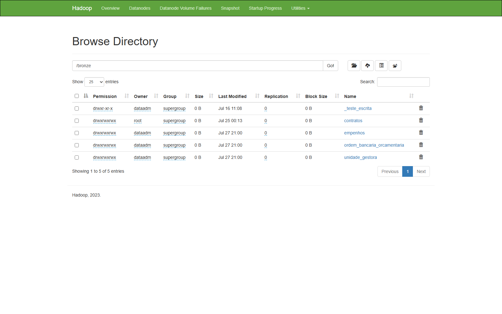<br>
      <sub><b>HDFS</b> — diretório <code>/bronze</code> particionado por fonte/ano/mês/data de extração.</sub>
    </td>
    <td width="50%">
      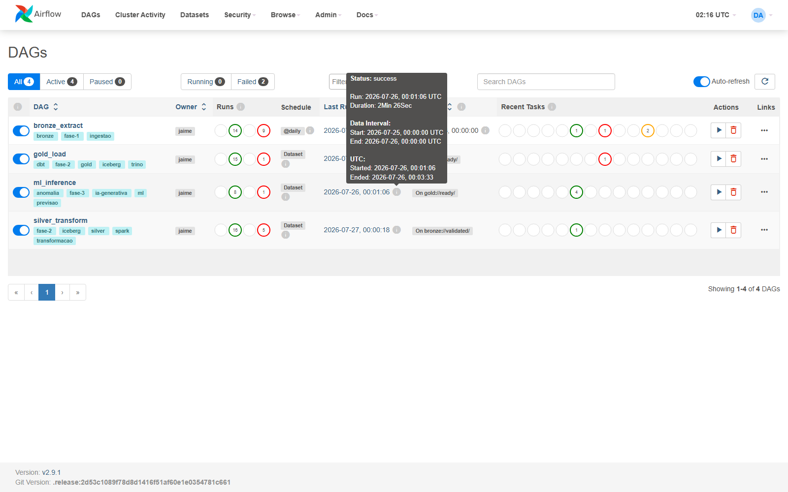<br>
      <sub><b>Airflow</b> — as 4 DAGs encadeadas por Dataset (Bronze → Silver → Gold → ML/IA).</sub>
    </td>
  </tr>
  <tr>
    <td width="50%">
      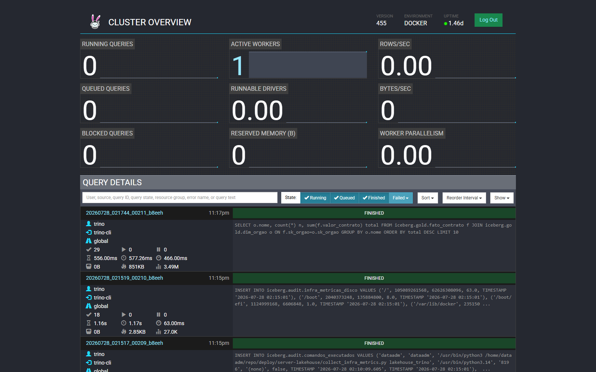<br>
      <sub><b>Trino</b> — consulta direta às tabelas Iceberg da Gold.</sub>
    </td>
    <td width="50%">
      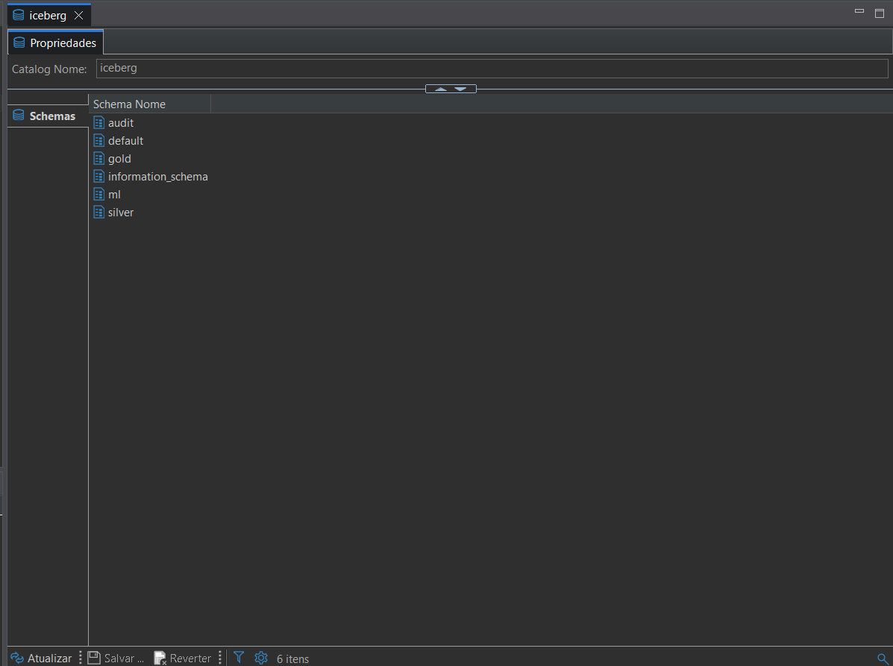<br>
      <sub><b>DBeaver</b> — exploração ad-hoc do catálogo <code>iceberg</code> via JDBC.</sub>
    </td>
  </tr>
  <tr>
    <td width="50%">
      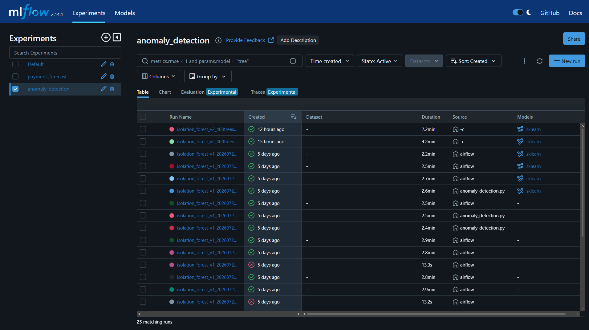<br>
      <sub><b>MLflow</b> — histórico de execuções dos dois modelos (parâmetros, métricas, artefatos).</sub>
    </td>
    <td width="50%"></td>
  </tr>
</table>

### Painel de negócio (Streamlit)

<table>
  <tr>
    <td width="50%">
      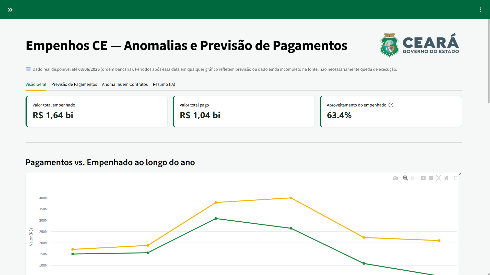<br>
      <sub><b>Visão Geral</b> — valor total empenhado/pago e execução financeira ao longo do ano.</sub>
    </td>
    <td width="50%">
      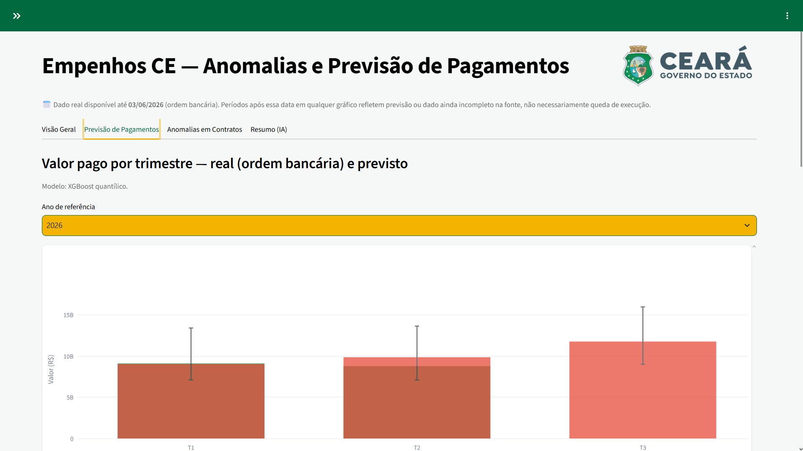<br>
      <sub><b>Previsão de Pagamentos</b> — valor real vs. previsto por trimestre (XGBoost quantílico, com faixa de incerteza).</sub>
    </td>
  </tr>
  <tr>
    <td width="50%">
      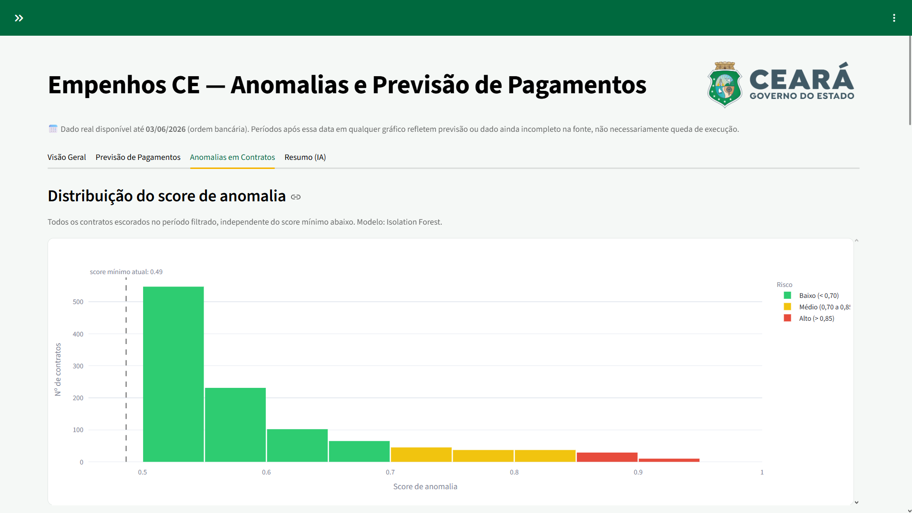<br>
      <sub><b>Anomalias em Contratos</b> — distribuição do score de anomalia (Isolation Forest) por faixa de risco.</sub>
    </td>
    <td width="50%"></td>
  </tr>
</table>

### Painéis operacionais (Superset)

<table>
  <tr>
    <td width="50%">
      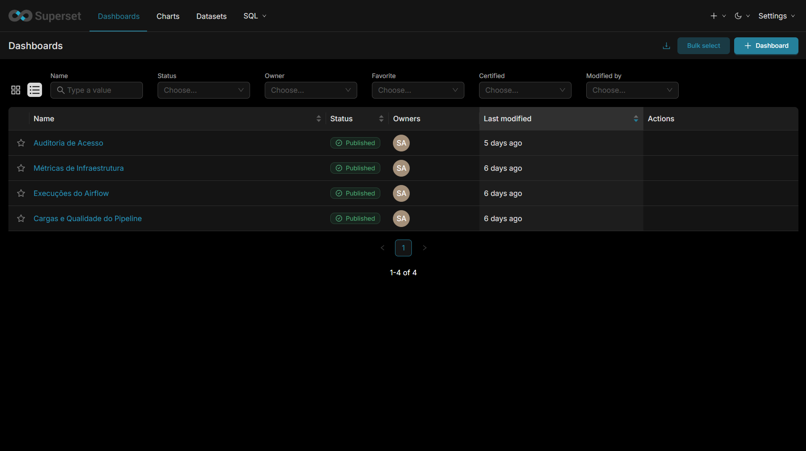<br>
      <sub><b>Dashboards</b> — os 4 painéis internos: cargas/qualidade, execuções do Airflow, infraestrutura e auditoria de acesso.</sub>
    </td>
    <td width="50%">
      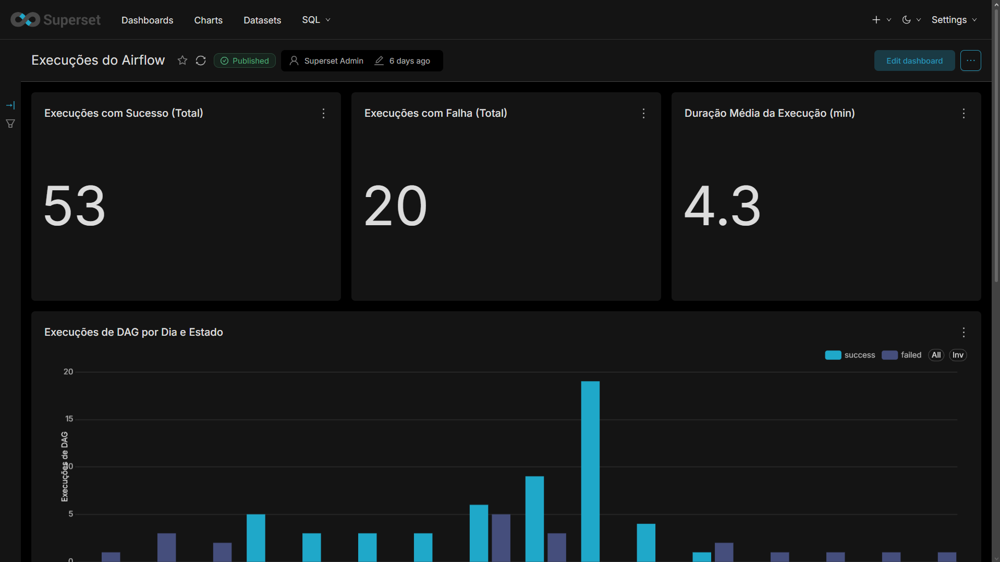<br>
      <sub><b>Execuções do Airflow</b> — sucesso/falha e duração média das DAGs, por dia.</sub>
    </td>
  </tr>
</table>

## Notebooks

`notebooks/` reúne a exploração usada para validar cada etapa do pipeline antes de
plugar nas DAGs:

| Notebook | Conecta em | Para quê |
|---|---|---|
| `exploracao_ingestao.ipynb` | API + Postgres (fontes) | Rodar os extractors por partes e inspecionar o dado antes da Bronze |
| `eda_bronze.ipynb` | Bronze — JSON via `src/extractors/storage.py` | Schema, nulos e formatos de data do dado bruto, sem normalização |
| `eda_silver.ipynb` | Silver — `iceberg.silver.*` via Trino | Volume por tabela, checagem de dedup do `MERGE INTO`, histórico de snapshots (time travel) |
| `eda_gold.ipynb` | Gold — `iceberg.gold.*` via Trino | Modelo estrela, cobertura de join fato→dimensão, checagem do SCD2 de `dim_credor` |
| `eda_e_treinamento_ml.ipynb` | Gold + Silver via Trino, `models/anomaly_detection.py`, `models/payment_forecast.py`, `models/narrative_report.py` | Treino e avaliação dos Modelos 1/2 + demonstração da IA generativa (Fase 3 completa, nome do notebook original da Fernanda — dona da atividade) |

Os últimos quatro exigem o stack do lakehouse no ar (Hive Metastore + Trino com as
tabelas já escritas).

## ML/IA (Fase 3)

| Modelo | Status | Onde |
|---|---|---|
| **Modelo 1** — detecção de anomalias em contratos | ✅ Treinado, avaliado e gravado na Gold | `models/anomaly_detection.py` (Isolation Forest, não supervisionado) + `notebooks/eda_e_treinamento_ml.ipynb` |
| **Modelo 2** — previsão de pagamentos trimestrais | ✅ Treinado, avaliado e gravado na Gold | `models/payment_forecast.py` (XGBoost, regressão por quantil) + `notebooks/eda_e_treinamento_ml.ipynb` |
| **Componente de IA generativa** — relatório narrativo | ✅ Gerando relatórios em produção | `models/narrative_report.py` (LLM via API OpenAI) |

**Modelo 1** lê `iceberg.gold.fato_contrato` + `dim_credor`/`dim_modalidade` e
`iceberg.silver.contratos` (para `tipo_objeto`/vigência, ainda não modelados na
Gold) via Trino, e produz um `score_anomalia` em `[0, 1]` por contrato — features:
valor, dias de vigência, modalidade e tipo de objeto (one-hot), flag de emergência
e histórico de infração do credor. Grava também `flag_anomalia` (classificação
binária do próprio `IsolationForest.predict()`, complementar ao score contínuo).
Gravado em `iceberg.gold.score_anomalia_contrato` (tabela própria, não um
`UPDATE` direto — `fato_contrato` é recriada do zero a cada `dbt build`) e
aparece em `fato_contrato.score_anomalia` via `LEFT JOIN`
(`dbt/models/marts/fato_contrato.sql`).

**Modelo 2** lê `iceberg.gold.fato_ordem_bancaria` — o pagamento efetivo ao
credor (3º estágio da despesa: contrato → empenho → ordem bancária) —
agregado por órgão/trimestre, excluindo ordens canceladas, e prevê o valor do
**próximo** trimestre com intervalo de confiança (quantis 0.1/0.5/0.9 via
`XGBRegressor`). Grava em `iceberg.gold.previsao_pagamento_orgao`.

**Componente de IA generativa** lê os dois resultados acima (`score_anomalia_contrato`
+ `previsao_pagamento_orgao`) via Trino, monta um prompt só com os números já
calculados (o LLM não recebe dado bruto nem infere valor novo — evita
alucinação) e usa a API OpenAI (`gpt-4o-mini` por padrão — modelo de baixo
custo, configurável via `OPENAI_MODEL`) para escrever um relatório em Markdown,
em linguagem sem jargão técnico, para um gestor público sem formação em dados.
Grava em `iceberg.gold.relatorio_narrativo` e em arquivo
(`models/artifacts/relatorios/`). Requer `OPENAI_API_KEY` no `.env` (nunca
commitado).

Os três são treinados/gerados automaticamente pela DAG `ml_inference`
(ver "Orquestração" acima) — **validada de ponta a ponta em produção**.

```bash
python -m models.anomaly_detection --contamination auto
python -m models.payment_forecast
python -m models.narrative_report
python -m pytest tests/test_anomaly_detection.py tests/test_payment_forecast.py tests/test_narrative_report.py -v
```

## Particularidades importantes (não estão no enunciado oficial)

### API de contratos

- **Formato de data real da API é `DD/MM/YYYY`**, não ISO. Os argumentos `--inicio`/`--fim` do script continuam em ISO (`YYYY-MM-DD`) por consistência com o extractor do Postgres — a conversão pro formato da API é feita internamente. Enviar ISO direto faz a API responder `HTTP 200` com texto puro de erro em vez de JSON.
- **A chave de paginação é `"sumary"`** (erro de digitação real da API, falta o 2º "m"), não `"summary"` como o enunciado sugere. O código já trata isso com fallback: `payload.get("sumary") or payload.get("summary")`.
- Se a resposta não trouxer `total_pages` de nenhuma das duas formas, a extração **aborta com erro** em vez de arriscar um loop infinito.
- `sleep` entre páginas e retry com backoff em respostas `429`/falha de rede, configuráveis via `.env`.

### PostgreSQL de origem

- Nenhuma tabela tem **PRIMARY KEY** declarada no banco real, mesmo as que o enunciado descreve com PK lógica (ex: `empenhos (PK: id, ano)`). Não assumir unicidade de `id` sem deduplicação a jusante.
- Colunas de data são `TEXT` (ex: `'2026-06-02 00:00:00.000'`), não `DATE`/`TIMESTAMP`. A comparação lexicográfica com `'YYYY-MM-DD'` funciona porque o prefixo é ISO 8601. A coluna real usada para filtro incremental é `dataemissao` (não `data_empenho`/`data_pagamento` como um rascunho antigo do enunciado sugeria).
- Cada tabela é gravada em **blocos de até `POSTGRES_EXTRACT_CHUNK_SIZE` linhas** (`chunk_0001.json`, `chunk_0002.json`, ...) em vez de um arquivo único — necessário porque o histórico completo de `empenhos`/`ordem_bancaria_orcamentaria` tem centenas de milhares a milhões de linhas, e um arquivo único ficaria grande demais para escrever de uma vez via WebHDFS.
- **A engine usa `execution_options={"stream_results": True}`** (cursor server-side do psycopg2). Sem isso, `pd.read_sql(..., chunksize=...)` só corta em blocos do lado do cliente — o Postgres tenta montar o resultado inteiro da query antes de mandar qualquer linha, e a carga histórica completa (~1,4M linhas em `empenhos`) estoura memória no servidor (`psycopg2.DatabaseError: out of memory for query result`) antes mesmo do primeiro chunk chegar.

### Silver (Iceberg) — o que o `MERGE INTO` resolveu

- A versão anterior (pandas, Parquet solto) só deduplicava **dentro** de uma execução — janelas incrementais sobrepostas duplicavam registros. O `silver_job.py` faz `MERGE INTO` por chave de negócio, deduplicando **entre execuções** direto na tabela Iceberg.
- A inferência de tipo do JSON varia entre lotes (ex: um campo ora `STRING`, ora `BOOLEAN`); a escrita faz cast de cada coluna do lote para o tipo da tabela alvo antes do `MERGE`, evitando `INCOMPATIBLE_DATA_FOR_TABLE`.

### Backend HDFS — atenção ao rodar fora da rede do Datalab

> O WebHDFS grava em duas etapas: o NameNode responde com um redirecionamento apontando para o **hostname interno do DataNode** (`hadoop`, porta `9864`) — nome que não resolve fora da rede Docker do Datalab. Se for rodar a extração com `BRONZE_STORAGE_BACKEND=hdfs` de uma máquina Windows fora do servidor (via VPN), é necessário adicionar ao `hosts` (`C:\Windows\System32\drivers\etc\hosts`):
>
> ```
> 100.69.31.14 hadoop
> ```
>
> Atenção a uma possível entrada conflitante `127.0.0.1 hadoop` criada pelo Docker Desktop — ela precisa estar comentada/removida, senão a escrita falha com `ConnectionRefusedError`/`MaxRetryError` mesmo com a permissão do HDFS correta.

## Chaves de junção — Contratos (API) × PostgreSQL

Validadas cruzando os contratos já extraídos contra o banco real.

| Campo API | Campo Postgres | Confiabilidade | Observação |
|---|---|---|---|
| `cod_gestora` | `empenhos.codigoug` / `unidade_gestora.codigo` | ✅ 100% match | Join confiável. `unidade_gestora` é versionada por `ano` — juntar sempre por `(codigo, ano)`. |
| `plain_cpf_cnpj_financiador` | `empenhos.codigocredor` | ⚠️ 96% match | Relação N:N (um credor pode ter vários contratos/empenhos) — não é join 1:1. |
| `num_spu` | `empenhos.codprocesso` | ❌ ~7,5% match | Mesmo formato de processo administrativo, mas baixa cobertura na amostra. Usar só como enriquecimento best-effort. Causa raiz investigada a fundo em 31/07/2026 (migração de formato entre fontes independentes, não erro de modelagem) — ver a nota "Causa raiz do ~7-8% de match" em [`documentacao/dicionario-dados.md`](documentacao/dicionario-dados.md), seção `fato_contrato`. |
| `num_contrato` / `plain_num_contrato` | `empenhos.codcontrato` | ❌ Sem correspondência | Domínios diferentes (provável código interno SIAFEM). Não usar sem achar um de-para real — confirmado (31/07/2026): também baixo preenchimento (35%) mesmo se houvesse de-para. |

> A própria API de contratos já retorna `calculated_valor_empenhado` e `calculated_valor_pago` por contrato, junto de `valor_contrato`/`valor_atualizado_concedente` — útil para métricas de execução financeira (% pago, % empenhado, detecção de pagamento acima do valor) sem depender do join fraco com `empenhos`/`ordem_bancaria_orcamentaria`.

## Status do projeto

**Fases 1, 2 e 3 concluídas de ponta a ponta** — Bronze, Silver, Gold e ML/IA
rodando automaticamente no Airflow real, encadeadas por Dataset, com o dado
histórico completo carregado e validado (ver seção "Camadas" acima).

| Frente | Status |
|---|---|
| Bronze — extração API + Postgres, watermark com lookback, validação | ✅ Concluída |
| Silver — Iceberg via Spark, `MERGE INTO`, cast de tipo | ✅ Concluída |
| Gold — modelo estrela dbt-trino (inclui `fato_ordem_bancaria`), SCD2, testes automatizados | ✅ Concluída |
| Orquestração — 4 DAGs encadeadas por Dataset (Bronze→Silver→Gold→ML) | ✅ 4/4 validadas em produção |
| Fase 3 — ML/IA — Modelo 1 (anomalia) + Modelo 2 (previsão) | ✅ Treinados, avaliados e rodando em produção via DAG 4 |
| Fase 3 — ML/IA — componente de IA generativa (relatório narrativo) | ✅ Gerando relatórios em produção via DAG 4 |
| Observabilidade — Superset (painéis operacionais) + schema `audit` (infra/acesso) | ✅ Em produção, coleta a cada 5min |
| CI/CD — 5 jobs de CI (lint/testes/Spark/dbt real) + deploy automatizado | ✅ Rodando a cada push (ver seção "CI/CD") |


---
Ceará Transparente — Pipeline de Dados e IA
