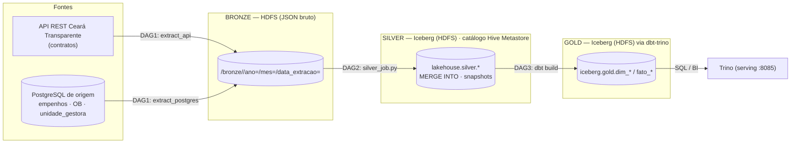

# Ceará Transparente — Pipeline de Dados (Lakehouse)

Pipeline de dados de **transparência pública do Ceará** (contratos + empenhos), em
arquitetura **medalhão (Bronze → Silver → Gold)** que evoluiu de um *data lake* para um
**lakehouse**: Silver e Gold são tabelas **Apache Iceberg** sobre HDFS, com um catálogo
único (**Hive Metastore**) compartilhado por **Spark** (escrita da Silver) e **Trino**
(transformação/serving da Gold via **dbt**), orquestrados de ponta a ponta pelo
**Airflow**.

`Fases 1 e 2 concluídas (Bronze → Silver → Gold, automáticas)` · Última atualização: 24/07/2026

## Visão geral

Duas fontes, sem trilha de auditoria nem chave confiável, viram uma base analítica
testável e versionada:

- **API REST do Ceará Transparente** — contratos públicos, com paginação.
- **PostgreSQL de origem** — `empenhos`, `ordem_bancaria_orcamentaria` (filtradas por
  data) e `unidade_gestora` (tabela de referência, completa a cada execução).



As três DAGs rodam **encadeadas por Dataset** (não por horário fixo) e disparam
sozinhas todos os dias — a cadeia completa `bronze → silver → gold` foi validada
rodando sem intervenção manual. Detalhes de arquitetura e das decisões técnicas em
[`documentacao/lakehouse-spark-iceberg.md`](documentacao/lakehouse-spark-iceberg.md) e
[`documentacao/gold-dbt-trino.md`](documentacao/gold-dbt-trino.md).

## Camadas

| Camada | Formato | Engine de escrita | Onde | Observação |
|---|---|---|---|---|
| **Bronze** | JSON bruto | Python (`src/extractors`) via WebHDFS | HDFS `/bronze` | zona raw imutável; particionada `ano=/mes=/data_extracao=` |
| **Silver** | **Iceberg** (Parquet) | **PySpark** (`src/spark_jobs/silver_job.py`) | HDFS `/warehouse/silver.db` | normalização + dedup **entre execuções** via `MERGE INTO` |
| **Gold** | **Iceberg** (Parquet) | **Trino** via **dbt** (`dbt/`) | HDFS `/warehouse/gold.db` | modelo estrela declarativo + testes dbt |

**Volumes reais validados (24/07/2026):** `empenhos` 1.376.379 · `ordem_bancaria_orcamentaria`
1.399.810 · `contratos` 215.402 · `unidade_gestora` 5.011 na Silver; na Gold, `fato_empenho`
1.376.379 · `fato_contrato` 215.518 · `dim_credor` 10.612 (**SCD2**) · `dim_orgao` 5.011 ·
`dim_tempo` 1.579 · `dim_modalidade` 21 (**32/32 nós dbt PASS**).

## Estrutura de diretórios

```
.
├── dags/                        # Airflow — 4 DAGs encadeadas por Dataset
│   ├── dag_bronze_extract.py    #   DAG 1: extract_api + extract_postgres + validate + watermark
│   ├── dag_silver_transform.py  #   DAG 2: dispara silver_job.py (Spark) via DockerOperator
│   ├── dag_gold_load.py         #   DAG 3: dispara dbt build (Trino) via DockerOperator
│   ├── dag_ml_inference.py      #   DAG 4: Modelo 1 + Modelo 2 + refresh de fato_contrato
│   └── common.py                #   constantes/Datasets compartilhados entre DAGs
├── src/
│   ├── extractors/              # Bronze — API paginada, Postgres em chunks, escrita WebHDFS
│   ├── transformers/            # regras de normalização/dedup compartilhadas (rules.py) e Silver legada (pandas)
│   ├── spark_jobs/               # Silver real do lakehouse — Bronze -> Iceberg (MERGE INTO)
│   └── validators/              # validação de schema/completude da Bronze
├── dbt/                          # Gold declarativa — staging -> dims -> fatos + testes (dbt-trino)
├── docker/                       # Dockerfiles do stack (airflow, spark, hive, trino)
├── deploy/server-lakehouse/      # overlay aditivo do lakehouse no servidor real do time
├── documentacao/                 # documentação técnica de entrega (arquitetura, dicionário de dados)
├── notebooks/                    # exploração de ingestão + EDA Bronze/Silver/Gold + treino/avaliação ML
├── models/                       # Fase 3 (ML/IA) — Modelo 1 (anomaly_detection.py) e Modelo 2 (payment_forecast.py)
├── tests/                        # pytest — extractors, validators, transformers, modelos de ML
├── apresentacao/                 # apresentação HTML do storytelling do projeto (gerada, git-ignorada)
├── .env / .env.example
└── requirements.txt
```


## Infraestrutura (Docker)

`docker-compose.yml` na raiz sobe o stack completo: PostgreSQL (metadados do Airflow +
DB `metastore`), Hadoop (NameNode + DataNode), Airflow (imagem custom com Java +
`pyspark` + providers `apache-spark`/`docker`), Jupyter, e o cluster do lakehouse —
**Spark** (master + worker), **Hive Metastore** e **Trino**.

```bash
docker compose up -d --build
```

Acesse Airflow em `http://localhost:8080` (usuário/senha criados por `airflow-init`:
`admin`/`admin`), o HDFS em `http://localhost:9870`, a UI do Spark master em
`http://localhost:8081` e o Trino em `http://localhost:8085`. `SOURCE_POSTGRES_URL`
(banco de origem) é externo a este compose — ver `.env.example`.

> No servidor real do time a topologia é diferente do compose da raiz (serviços
> pré-existentes do curso + um **overlay aditivo** só com os 4 serviços do lakehouse) —
> ver [`deploy/server-lakehouse/`](deploy/server-lakehouse/).

> Se o build falhar com erro de DNS (`Temporary failure in name resolution`) em um host
> com egress restrito para as redes bridge do Docker, ver `docker/airflow/README.md`.

## Orquestração — Airflow

As 4 DAGs rodam encadeadas por **Dataset** (o Airflow dispara a próxima assim que a
anterior emite o seu, em vez de depender de um horário fixo que poderia rodar cedo
demais):

| DAG | Gatilho | O que faz |
|---|---|---|
| `bronze_extract` | `@daily` | API + Postgres → Bronze, valida, avança watermark (com lookback configurável). Emite `bronze://validated`. |
| `silver_transform` | Dataset `bronze://validated` | `silver_job.py` via `DockerOperator` (imagem `datalab-spark`, `spark-submit local[*]`). Emite `silver://ready`. |
| `gold_load` | Dataset `silver://ready` | `dbt build` via `DockerOperator` (imagem `datalab-dbt`) — 32 nós: modelos + snapshot SCD2 + testes. Emite `gold://ready`. |
| `ml_inference` | Dataset `gold://ready` | Modelo 1 + Modelo 2 (`PythonOperator`, direto na imagem do Airflow) + `dbt build --select fato_contrato` (`DockerOperator`) para o score de anomalia aparecer no fato na mesma execução. |

O cluster Spark standalone (`spark-master`/`worker`) fica reservado para **backfills
manuais pesados** (validado processando os 1,38M de empenhos do histórico completo).

> A DAG `ml_inference` (tarefas 20–24) está **validada de ponta a ponta no
> Airflow real do servidor (24/07/2026)** — as 3 tasks rodaram com sucesso
> contra a Gold real: `score_anomalia_contrato` (152.785 linhas) e
> `previsao_pagamento_orgao` (4.423 linhas) gravadas via Trino, e
> `fato_contrato.score_anomalia` foi de 100% `NULL` para **215.785/215.785
> preenchido** depois do `refresh_fato_contrato`. Três bugs só apareceram
> rodando contra produção (join sem `CAST`, lote de gravação lento, `Decimal`
> do driver Trino quebrando o XGBoost) — corrigidos, ver `docs/infos.md` e
> `docs/06-analise-critica.md` (item 13).

## Configuração

Copie `.env.example` para `.env` e ajuste os valores.

| Variável | Descrição | Padrão |
|---|---|---|
| `CEARA_TRANSPARENTE_API_URL` | Endpoint base da API de contratos | URL oficial da API |
| `CEARA_API_TIMEOUT_SECONDS` / `_SLEEP_SECONDS` / `_MAX_RETRIES` | Timeout, espera entre páginas, tentativas em `429`/falha | 30 / 1.0 / 3 |
| `SOURCE_POSTGRES_URL` | String de conexão do Postgres de origem | — |
| `POSTGRES_EXTRACT_CHUNK_SIZE` | Máx. de linhas por arquivo JSON gravado | 20000 |
| `BRONZE_STORAGE_BACKEND` / `SILVER_STORAGE_BACKEND` | `local` (disco) ou `hdfs` (WebHDFS) | local |
| `BRONZE_BASE_PATH` / `SILVER_BASE_PATH` | Caminho base — relativo se `local`, absoluto se `hdfs` | `./data/bronze` / `./data/silver` |
| `HDFS_WEBHDFS_URL` / `HDFS_USER` | URL do NameNode (WebHDFS) e usuário HDFS | — |
| `HDFS_HOST` | Hostname do HDFS (`namenode` no stack autônomo, `hadoop` no servidor) | namenode |
| `TRINO_HOST` / `TRINO_PORT` / `TRINO_USER` / `TRINO_CATALOG` | Conexão do Trino — usada pelos notebooks de EDA em Silver/Gold | trino / 8080 / notebook / iceberg |

> **Nunca commitar o `.env`** — já está no `.gitignore`. Só o `.env.example` (sem
> credenciais reais) deve ir para o repositório.

## Como rodar

```bash
# Bronze — os dois extractors têm como default a carga histórica completa
# (--inicio 2022-01-10, data mínima real confirmada, até hoje)
python -m src.extractors.api_extractor
python -m src.extractors.postgres_extractor

# Silver — Bronze -> Iceberg (requer cluster Spark + Hive Metastore no ar)
spark-submit src/spark_jobs/silver_job.py --run-date 2026-07-24

# Gold — Silver -> Iceberg via dbt (requer Trino no ar)
cd dbt && dbt build

# ML — Modelo 1 (anomalias) e Modelo 2 (previsão), lêem/gravam via Trino (requer Gold construída)
python -m models.anomaly_detection --contamination auto
python -m models.payment_forecast

# Testes
python -m pytest tests/ -v
```

Para uma janela específica (ex: extração incremental manual), passe `--inicio`/`--fim`
em ISO (`YYYY-MM-DD`):

```bash
python -m src.extractors.api_extractor --inicio 2026-06-01 --fim 2026-06-03
python -m src.extractors.postgres_extractor --inicio 2026-06-01 --fim 2026-06-04
```

## Notebooks

`notebooks/` reúne a exploração usada para validar cada etapa do pipeline antes de
plugar nas DAGs:

| Notebook | Conecta em | Para quê |
|---|---|---|
| `exploracao_ingestao.ipynb` | API + Postgres (fontes) | Rodar os extractors por partes e inspecionar o dado antes da Bronze |
| `eda_bronze.ipynb` | Bronze — JSON via `src/extractors/storage.py` | Schema, nulos e formatos de data do dado bruto, sem normalização |
| `eda_silver.ipynb` | Silver — `iceberg.silver.*` via Trino | Volume por tabela, checagem de dedup do `MERGE INTO`, histórico de snapshots (time travel) |
| `eda_gold.ipynb` | Gold — `iceberg.gold.*` via Trino | Modelo estrela, cobertura de join fato→dimensão, checagem do SCD2 de `dim_credor` |
| `ml_anomalia_contratos.ipynb` | Gold + Silver via Trino, `models/anomaly_detection.py` | Treino e avaliação do Modelo 1 (detecção de anomalias) |
| `ml_previsao_pagamentos.ipynb` | Gold via Trino, `models/payment_forecast.py` | Treino e avaliação do Modelo 2 (previsão trimestral de pagamentos) |

Os últimos quatro exigem o stack do lakehouse no ar (Hive Metastore + Trino com as
tabelas já escritas).

## ML/IA (Fase 3)

| Modelo | Status | Onde |
|---|---|---|
| **Modelo 1** — detecção de anomalias em contratos | ✅ Treinado, avaliado e gravado na Gold | `models/anomaly_detection.py` (Isolation Forest, não supervisionado) + `notebooks/ml_anomalia_contratos.ipynb` |
| **Modelo 2** — previsão de pagamentos trimestrais | ✅ Treinado, avaliado e gravado na Gold | `models/payment_forecast.py` (XGBoost, regressão por quantil) + `notebooks/ml_previsao_pagamentos.ipynb` |
| Componente de IA generativa (relatório narrativo) | ⏳ Não iniciado | — |

**Modelo 1** lê `iceberg.gold.fato_contrato` + `dim_credor`/`dim_modalidade` e
`iceberg.silver.contratos` (para `tipo_objeto`/vigência, ainda não modelados na
Gold) via Trino, e produz um `score_anomalia` em `[0, 1]` por contrato — features:
valor, dias de vigência, modalidade e tipo de objeto (one-hot), flag de emergência
e histórico de infração do credor. O score é gravado em
`iceberg.gold.score_anomalia_contrato` (tabela própria, não um `UPDATE` direto —
`fato_contrato` é recriada do zero a cada `dbt build`) e aparece em
`fato_contrato.score_anomalia` via `LEFT JOIN` (`dbt/models/marts/fato_contrato.sql`).

**Modelo 2** lê `iceberg.gold.fato_empenho` — usado como **proxy** de
`iceberg.gold.fato_ordem_bancaria`, que ainda não existe na Gold (gap conhecido,
`docs/06-analise-critica.md`) — agregado por órgão/trimestre, e prevê o valor do
**próximo** trimestre com intervalo de confiança (quantis 0.1/0.5/0.9 via
`XGBRegressor`). Grava em `iceberg.gold.previsao_pagamento_orgao`.

Os dois modelos são treinados/gravados automaticamente pela DAG `ml_inference`
(ver "Orquestração" acima) — ainda não validada em produção.

```bash
python -m models.anomaly_detection --contamination auto
python -m models.payment_forecast
python -m pytest tests/test_anomaly_detection.py tests/test_payment_forecast.py -v
```

## Particularidades importantes (não estão no enunciado oficial)

### API de contratos

- **Formato de data real da API é `DD/MM/YYYY`**, não ISO. Os argumentos `--inicio`/`--fim` do script continuam em ISO (`YYYY-MM-DD`) por consistência com o extractor do Postgres — a conversão pro formato da API é feita internamente. Enviar ISO direto faz a API responder `HTTP 200` com texto puro de erro em vez de JSON.
- **A chave de paginação é `"sumary"`** (erro de digitação real da API, falta o 2º "m"), não `"summary"` como o enunciado sugere. O código já trata isso com fallback: `payload.get("sumary") or payload.get("summary")`.
- Se a resposta não trouxer `total_pages` de nenhuma das duas formas, a extração **aborta com erro** em vez de arriscar um loop infinito.
- `sleep` entre páginas e retry com backoff em respostas `429`/falha de rede, configuráveis via `.env`.

### PostgreSQL de origem

- Nenhuma tabela tem **PRIMARY KEY** declarada no banco real, mesmo as que o enunciado descreve com PK lógica (ex: `empenhos (PK: id, ano)`). Não assumir unicidade de `id` sem deduplicação a jusante.
- Colunas de data são `TEXT` (ex: `'2026-06-02 00:00:00.000'`), não `DATE`/`TIMESTAMP`. A comparação lexicográfica com `'YYYY-MM-DD'` funciona porque o prefixo é ISO 8601. A coluna real usada para filtro incremental é `dataemissao` (não `data_empenho`/`data_pagamento` como um rascunho antigo do enunciado sugeria).
- Cada tabela é gravada em **blocos de até `POSTGRES_EXTRACT_CHUNK_SIZE` linhas** (`chunk_0001.json`, `chunk_0002.json`, ...) em vez de um arquivo único — necessário porque o histórico completo de `empenhos`/`ordem_bancaria_orcamentaria` tem centenas de milhares a milhões de linhas, e um arquivo único ficaria grande demais para escrever de uma vez via WebHDFS.
- **A engine usa `execution_options={"stream_results": True}`** (cursor server-side do psycopg2). Sem isso, `pd.read_sql(..., chunksize=...)` só corta em blocos do lado do cliente — o Postgres tenta montar o resultado inteiro da query antes de mandar qualquer linha, e a carga histórica completa (~1,4M linhas em `empenhos`) estoura memória no servidor (`psycopg2.DatabaseError: out of memory for query result`) antes mesmo do primeiro chunk chegar.

### Silver (Iceberg) — o que o `MERGE INTO` resolveu

- A versão anterior (pandas, Parquet solto) só deduplicava **dentro** de uma execução — janelas incrementais sobrepostas duplicavam registros. O `silver_job.py` faz `MERGE INTO` por chave de negócio, deduplicando **entre execuções** direto na tabela Iceberg.
- A inferência de tipo do JSON varia entre lotes (ex: um campo ora `STRING`, ora `BOOLEAN`); a escrita faz cast de cada coluna do lote para o tipo da tabela alvo antes do `MERGE`, evitando `INCOMPATIBLE_DATA_FOR_TABLE`.

### Backend HDFS — atenção ao rodar fora da rede do Datalab

> O WebHDFS grava em duas etapas: o NameNode responde com um redirecionamento apontando para o **hostname interno do DataNode** (`hadoop`, porta `9864`) — nome que não resolve fora da rede Docker do Datalab. Se for rodar a extração com `BRONZE_STORAGE_BACKEND=hdfs` de uma máquina Windows fora do servidor (via VPN), é necessário adicionar ao `hosts` (`C:\Windows\System32\drivers\etc\hosts`):
>
> ```
> 100.69.31.14 hadoop
> ```
>
> Atenção a uma possível entrada conflitante `127.0.0.1 hadoop` criada pelo Docker Desktop — ela precisa estar comentada/removida, senão a escrita falha com `ConnectionRefusedError`/`MaxRetryError` mesmo com a permissão do HDFS correta.

## Chaves de junção — Contratos (API) × PostgreSQL

Validadas cruzando os contratos já extraídos contra o banco real.

| Campo API | Campo Postgres | Confiabilidade | Observação |
|---|---|---|---|
| `cod_gestora` | `empenhos.codigoug` / `unidade_gestora.codigo` | ✅ 100% match | Join confiável. `unidade_gestora` é versionada por `ano` — juntar sempre por `(codigo, ano)`. |
| `plain_cpf_cnpj_financiador` | `empenhos.codigocredor` | ⚠️ 96% match | Relação N:N (um credor pode ter vários contratos/empenhos) — não é join 1:1. |
| `num_spu` | `empenhos.codprocesso` | ❌ ~7,5% match | Mesmo formato de processo administrativo, mas baixa cobertura na amostra. Usar só como enriquecimento best-effort. |
| `num_contrato` / `plain_num_contrato` | `empenhos.codcontrato` | ❌ Sem correspondência | Domínios diferentes (provável código interno SIAFEM). Não usar sem achar um de-para real. |

> A própria API de contratos já retorna `calculated_valor_empenhado` e `calculated_valor_pago` por contrato, junto de `valor_contrato`/`valor_atualizado_concedente` — útil para métricas de execução financeira (% pago, % empenhado, detecção de pagamento acima do valor) sem depender do join fraco com `empenhos`/`ordem_bancaria_orcamentaria`.

## Status do projeto

**Fases 1 e 2 concluídas de ponta a ponta** — Bronze, Silver e Gold rodando
automaticamente no Airflow real, encadeadas por Dataset, com o dado histórico completo
carregado e validado (ver seção "Camadas" acima).

| Frente | Status |
|---|---|
| Bronze — extração API + Postgres, watermark com lookback, validação | ✅ Concluída |
| Silver — Iceberg via Spark, `MERGE INTO`, cast de tipo | ✅ Concluída |
| Gold — modelo estrela dbt-trino, SCD2, 32/32 testes | ✅ Concluída |
| Orquestração — 4 DAGs encadeadas por Dataset (Bronze→Silver→Gold→ML) | ✅ 4/4 validadas em produção |
| Fase 3 — ML/IA — Modelo 1 (anomalia) + Modelo 2 (previsão) | ✅ Treinados, avaliados e rodando em produção via DAG 4 |
| Fase 3 — ML/IA — componente de IA generativa | ⏳ Próxima etapa |

Pendências conhecidas e assumidas conscientemente (reconciliação entre camadas,
`ordem_bancaria_orcamentaria` sem modelo Gold, segurança lab-grade, SPOF do HDFS) estão
documentadas na pasta interna do time (`docs/`, não versionada).

## Equipe

| Pessoa | Frente |
|---|---|
| Nara | Ingestão — extractors da API e do Postgres (Bronze) |
| Jaime | Orquestração e lakehouse — Airflow, Silver/Gold, evolução para Iceberg + Spark + Trino + dbt |
| Carlos | Modelagem de dados |
| Fernanda | ML — Fase 3 (anomalia e previsão) |
| Benjamim | IA generativa — Fase 3 (relatório narrativo) |

---
Ceará Transparente — Pipeline de Dados e IA
