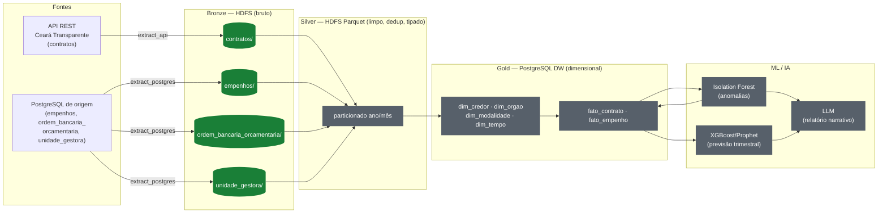
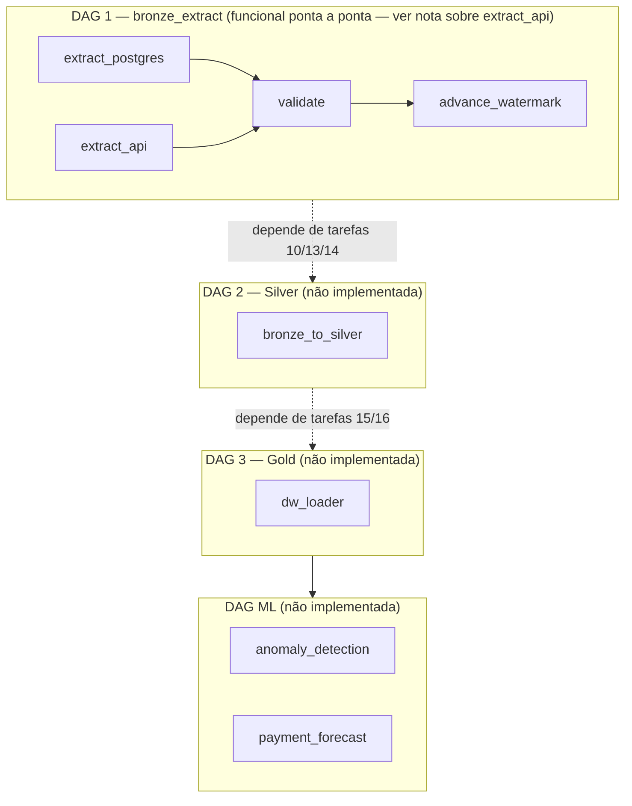
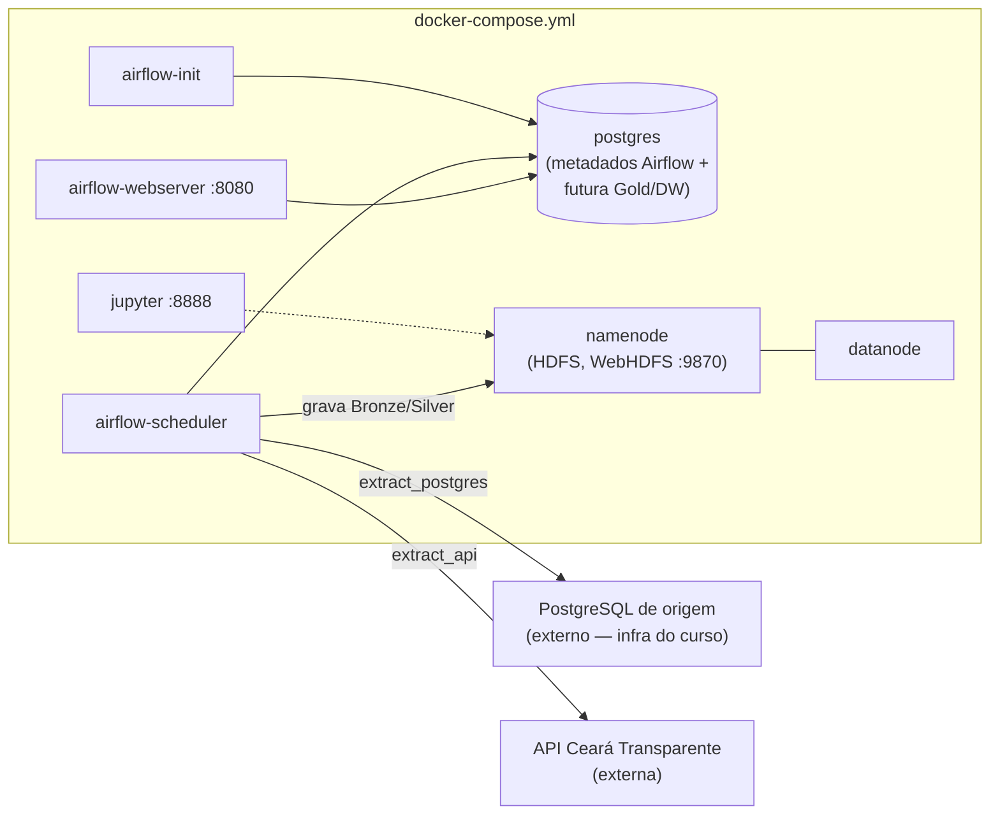

# Diagrama de Arquitetura — Pipeline Ceará Transparente

Última atualização: 19/07/2026. Status por componente conforme o [`checklist`](../docs/checklist.md)
interno da equipe (não versionado) — aqui mantemos apenas o retrato público da arquitetura.

## Visão geral (Medallion: Bronze → Silver → Gold → ML/IA)

**Legenda de status:** 🟢 verde = concluído e validado dentro do Airflow · 🟠 laranja = concluído via
workaround manual (fora do Airflow) · ⚪ cinza = não iniciado.

## Orquestração — DAGs do Airflow

## Infraestrutura (`docker-compose.yml`)

> **Nota sobre o Postgres de origem:** `SOURCE_POSTGRES_URL` aponta para um banco
> fornecido pela infraestrutura do curso (fora deste `docker-compose.yml`, hoje
> acessado via relay `pg-source-relay.service` no servidor do Datalab). O compose
> não tenta recriar esse banco — apenas o consome como fonte externa.
>
> **Nota sobre `extract_api`:** o host não tem saída IPv4 (só IPv6), mas a API do
> Ceará Transparente é IPv4-only. `extra_hosts` neste compose aponta o hostname da
> API para um relay TCP via Tailscale — ver
> [`workaround-egress-ipv4-api.md`](workaround-egress-ipv4-api.md) para o mecanismo
> completo e a limitação (depende de uma máquina do time estar ligada).

## Status resumido (19/07/2026)

| Camada/Componente | Status |
|---|---|
| Bronze — `empenhos`, `ordem_bancaria_orcamentaria`, `unidade_gestora` | ✅ Validado no HDFS real |
| Bronze — `contratos` (API) | ✅ Validado dentro do Airflow (19/07 — via relay, ver nota acima) |
| DAG 1 (`bronze_extract`) no Airflow | ✅ 4/4 tasks com sucesso ponta a ponta (`extract_postgres`, `extract_api`, `validate`, `advance_watermark`) — primeira execução 100% dentro do Airflow |
| Silver | ⚪ Não iniciada |
| Gold (DW) | ⚪ Não iniciada — nenhuma tabela dimensional/fato existe ainda |
| ML/IA | ⚪ Não iniciada |
| `docker-compose.yml` reproduzível | ✅ Adicionado (Postgres, Hadoop NameNode/DataNode, Airflow com imagem custom, Jupyter) |
