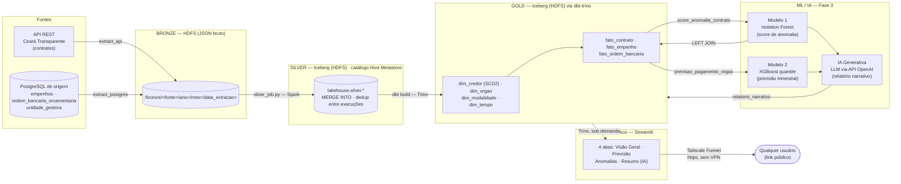
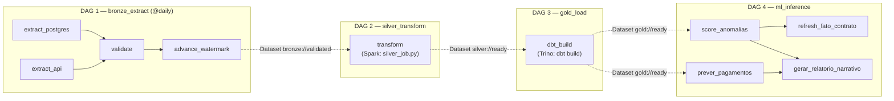
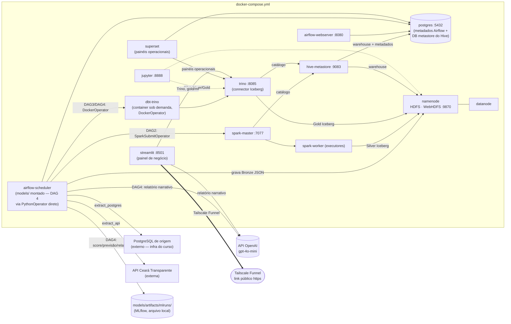

# Diagrama de Arquitetura — Pipeline Ceará Transparente

Última atualização: 31/07/2026 — **Fases 1, 2 e 3 concluídas de ponta a
ponta**, validadas rodando automaticamente no Airflow real do servidor
(tarefa 26, cadeia completa Bronze→Silver→Gold→ML/IA sem intervenção
manual), **mais um painel de negócio (Streamlit)** consumindo a Gold/ML,
hospedado publicamente via Tailscale Funnel. Evolução para **lakehouse**
(Silver em Iceberg, Spark, Hive Metastore, Trino via dbt) documentada em
[`lakehouse-spark-iceberg.md`](lakehouse-spark-iceberg.md) e
[`gold-dbt-trino.md`](gold-dbt-trino.md).

## 1. Visão geral — fluxo de dados (Medallion: Bronze → Silver → Gold → ML/IA → Painel)

```mermaid
flowchart LR
    subgraph Fontes
        API["API REST\nCeará Transparente\n(contratos)"]
        PG[("PostgreSQL de origem\nempenhos · ordem_bancaria_orcamentaria\nunidade_gestora")]
    end

    subgraph Bronze["BRONZE — HDFS (JSON bruto)"]
        B[("/bronze/&lt;fonte&gt;/ano=/mes=/data_extracao=")]
    end

    subgraph Silver["SILVER — Iceberg (HDFS) · catálogo Hive Metastore"]
        S[("lakehouse.silver.*\nMERGE INTO · dedup entre execuções")]
    end

    subgraph Gold["GOLD — Iceberg (HDFS) via dbt-trino"]
        DIM["dim_credor (SCD2) · dim_orgao\ndim_modalidade · dim_tempo"]
        FATO["fato_contrato · fato_empenho\nfato_ordem_bancaria"]
    end

    subgraph MLIA["ML / IA — Fase 3"]
        M1["Modelo 1\nIsolation Forest\n(score de anomalia)"]
        M2["Modelo 2\nXGBoost quantile\n(previsão trimestral)"]
        M3["IA Generativa\nLLM via API OpenAI\n(relatório narrativo)"]
    end

    subgraph Painel["Painel de negócio — Streamlit"]
        ST["4 abas: Visão Geral · Previsão\nAnomalias · Resumo (IA)"]
    end

    USER(["Qualquer usuário\n(link público)"])

    API -->|extract_api| B
    PG -->|extract_postgres| B
    B -->|silver_job.py — Spark| S
    S -->|dbt build — Trino| DIM --> FATO
    FATO -->|score_anomalia_contrato| M1 -->|LEFT JOIN| FATO
    FATO -->|previsao_pagamento_orgao| M2
    M1 --> M3
    M2 --> M3
    M3 -->|relatorio_narrativo| Gold
    Gold -->|Trino, sob demanda| ST
    ST -->|Tailscale Funnel\nhttps, sem VPN| USER
```

**Legenda de status:** todas as camadas acima estão **✅ concluídas e
validadas rodando de verdade dentro do Airflow**, sem workaround manual — ver
seção "Status resumido" no final deste documento. O Painel é a única peça
acessível **sem** estar na tailnet do time (Funnel expõe publicamente); todo
o resto exige VPN Tailscale.

## 2. Orquestração — dependência entre as 4 DAGs (por Dataset)

```mermaid
flowchart LR
    subgraph DAG1["DAG 1 — bronze_extract (@daily)"]
        d1a[extract_postgres] --> d1c[validate]
        d1b[extract_api] --> d1c
        d1c --> d1d[advance_watermark]
    end
    subgraph DAG2["DAG 2 — silver_transform"]
        d2a["transform\n(Spark: silver_job.py)"]
    end
    subgraph DAG3["DAG 3 — gold_load"]
        d3a["dbt_build\n(Trino: dbt build)"]
    end
    subgraph DAG4["DAG 4 — ml_inference"]
        d4a[score_anomalias] --> d4c[refresh_fato_contrato]
        d4a --> d4d[gerar_relatorio_narrativo]
        d4b[prever_pagamentos] --> d4d
    end

    d1d -.->|Dataset bronze://validated| d2a
    d2a -.->|Dataset silver://ready| d3a
    d3a -.->|Dataset gold://ready| d4a
    d3a -.->|Dataset gold://ready| d4b
```

Disparo **por Dataset**, não por horário fixo (só a DAG 1 é `@daily`) — cada
DAG dispara assim que a anterior emite seu Dataset de saída, nunca antes dos
dados estarem prontos. Cadeia completa validada rodando do zero sem
intervenção manual: ~5 minutos do trigger da Bronze até o relatório
narrativo sair (`gerar_relatorio_narrativo`).

## 3. Infraestrutura — containers, portas e conexões

```mermaid
flowchart LR
    subgraph Docker["docker-compose.yml"]
        PG_META[("postgres :5432\n(metadados Airflow +\nDB metastore do Hive)")]
        NN["namenode\nHDFS · WebHDFS :9870"]
        DN["datanode"]
        AF_WEB["airflow-webserver :8080"]
        AF_SCH["airflow-scheduler\n(models/ montado — DAG 4\nvia PythonOperator direto)"]
        SM["spark-master :7077"]
        SW["spark-worker (executores)"]
        HMS["hive-metastore :9083"]
        TR["trino :8085\n(connector Iceberg)"]
        DBT["dbt-trino\n(container sob demanda,\nDockerOperator)"]
        JUP["jupyter :8888"]
        SUP["superset\n(painéis operacionais)"]
        STR["streamlit :8501\n(painel de negócio)"]
    end
    SRC_PG["PostgreSQL de origem\n(externo — infra do curso)"]
    SRC_API["API Ceará Transparente\n(externa)"]
    OPENAI[("API OpenAI\ngpt-4o-mini")]
    MLF[("models/artifacts/mlruns/\n(MLflow, arquivo local)")]
    FUNNEL(["Tailscale Funnel\nlink público https"])

    AF_SCH -->|extract_postgres| SRC_PG
    AF_SCH -->|extract_api| SRC_API
    AF_SCH -->|grava Bronze JSON| NN
    AF_SCH -->|DAG2: SparkSubmitOperator| SM --> SW
    AF_SCH -->|DAG3/DAG4: DockerOperator| DBT --> TR
    AF_SCH -->|DAG4: score/previsão/relatório| MLF
    AF_SCH -->|DAG4: relatório narrativo| OPENAI
    SW -->|Silver Iceberg| NN
    TR -->|Gold Iceberg| NN
    SM -->|catálogo| HMS
    TR -->|catálogo| HMS
    HMS -->|warehouse + metadados| PG_META
    HMS -->|warehouse| NN
    NN --- DN
    AF_WEB --> PG_META
    AF_SCH --> PG_META
    JUP -.-> NN
    JUP -.->|EDA Silver/Gold| TR
    SUP -->|painéis operacionais| TR
    SUP --> PG_META
    STR -->|Trino, gold/ml| TR
    STR -->|relatório narrativo| OPENAI
    STR ==>|Tailscale Funnel| FUNNEL
```

> **No servidor real do time**, a topologia é um **overlay aditivo** sobre a
> infra já existente do curso (Hadoop compartilhado `aula_hadoop`, dois
> Postgres — metadados do Airflow e DW) em vez do stack autônomo acima. A
> diferença não é estrutural, só *quais containers já existiam* antes do
> lakehouse ser adicionado — ver
> [`deploy/server-lakehouse/`](../deploy/server-lakehouse/).
>
> **Egress IPv4:** o `datalab-server` só tinha rota IPv6 até 24/07/2026
> (`dhcp4: true` no netplan corrigiu isso na raiz) — `extract_api` não
> depende mais de relay TCP em máquina pessoal, ver
> [`workaround-egress-ipv4-api.md`](workaround-egress-ipv4-api.md) para o
> histórico do workaround já descontinuado.

## Status resumido (31/07/2026)

| Camada/Componente | Status |
|---|---|
| Bronze — `empenhos`, `ordem_bancaria_orcamentaria`, `unidade_gestora`, `contratos` | ✅ Validado no HDFS real, extração incremental com watermark + lookback |
| DAG 1 (`bronze_extract`) | ✅ 4/4 tasks — `extract_postgres`, `extract_api` (direto, sem relay), `validate`, `advance_watermark` |
| Silver — Iceberg via Spark (`silver_job.py`, `MERGE INTO`) | ✅ Validada em produção, idempotência provada por teste real (Spark+Iceberg local) |
| Gold — Iceberg via dbt-trino (32 nós: dims/fatos/snapshot SCD2/testes) | ✅ Validada em produção, 32/32 PASS |
| Reconciliação Bronze→Silver→Gold | ✅ `bronze_ingestao` + `gold_reconciliacao`, testes WARN |
| Cluster Spark + Hive Metastore + Trino + Iceberg (HDFS) | ✅ No ar, limites de recurso configurados |
| Modelo 1 — detecção de anomalias (Isolation Forest) | ✅ Treinado, escorado (215.839 contratos), threshold calibrável via distribuição real do score |
| Modelo 2 — previsão de pagamentos (XGBoost quantile) | ✅ Treinado sobre `fato_ordem_bancaria` real (não mais proxy), inclui previsão retroativa (`is_backtest`) pra validar previsto vs. realizado em trimestres já fechados |
| IA Generativa — relatório narrativo (LLM) | ✅ Gerando relatórios em produção via API OpenAI, com verificação anti-alucinação (`report_validation.py`) |
| MLflow tracking (Modelos 1 e 2) | ✅ Params/métricas/artefatos logados a cada run |
| DAG 4 (`ml_inference`) | ✅ 4/4 tasks — `score_anomalias`, `prever_pagamentos`, `refresh_fato_contrato`, `gerar_relatorio_narrativo` |
| Orquestração — 4 DAGs encadeadas por Dataset | ✅ Cadeia completa validada rodando automaticamente, sem intervenção manual |
| Painel de negócio (Streamlit, 4 abas) | ✅ Em produção, hospedado publicamente via Tailscale Funnel — acessível sem VPN, diferente do resto do stack |
| Superset — painéis operacionais (infra/acesso) | ✅ Em produção, ver "Observabilidade e auditoria" no README |
| CI (lint + testes + dbt) | ✅ 6 jobs de CI verdes (`lint`, `tests`, `streamlit-smoke`, `spark-tests`, `dbt`, `dbt-integration`) + 1 de deploy |

Pendências conhecidas (não bloqueantes, ver
[`03-pendencias-e-melhorias.md`](../docs/03-pendencias-e-melhorias.md) e
[`06-analise-critica.md`](../docs/06-analise-critica.md)): segurança
lab-grade (Trino/HMS sem auth), reconciliação Bronze→Silver não é
byte-a-byte, `bulk_insert`/`replace_table` do Trino não são comprovadamente
idempotentes sob retry de rede (item 15).
