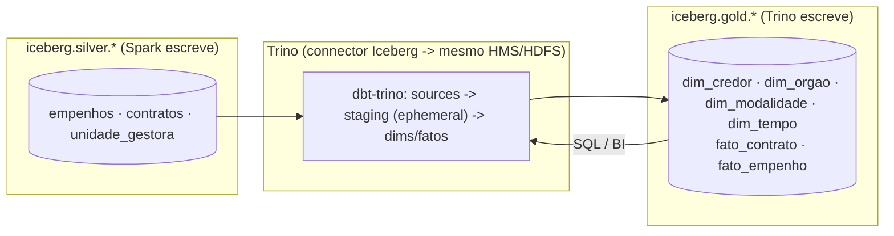

# Gold com dbt-trino sobre Iceberg (lakehouse puro)

Última atualização: 23/07/2026. Complementa
[`lakehouse-spark-iceberg.md`](lakehouse-spark-iceberg.md) (camada Silver).

## Por que / o que muda

A Gold era construída de forma **imperativa** (`src/loaders/dw_loader.py`, pandas +
psycopg2 → Postgres DW; orquestrada pela DAG 3 via Spark `gold_job.py`). Passa a ser
**declarativa** em **dbt-trino**, materializada como **tabelas Iceberg**
(`iceberg.gold.*`) no HDFS e servida pelo **Trino** — fechando o lakehouse: um só
storage (Iceberg/HDFS) e um catálogo (Hive Metastore) compartilhado por **Spark**
(escrita da Silver) e **Trino** (transformação/serving da Gold).

Ganhos: modelos SQL versionados, **testes/lineage/docs** do dbt no lugar de código
imperativo, snapshots/time travel também na Gold, e Trino como camada de consulta.

Papéis: **Spark** = escrita pesada da Silver (`MERGE`); **Trino + dbt** = Gold
declarativa + serving. O Spark deixa de ser necessário na Gold.

## Arquitetura



## Componentes

- **Trino single-node** (`docker/trino/`): imagem `trinodb/trino:455` + catálogos
  `iceberg` (`type=hive_metastore`, `hive.metastore.uri=thrift://hive-metastore:9083`,
  `fs.hadoop.enabled=true`, `hive.config.resources=.../hadoop/core-site.xml`) e
  `postgres` (federação opcional com o DW antigo). Porta host **8085**.
- **Projeto dbt** (`dbt/`): adapter dbt-trino, catálogo alvo `iceberg`, schema `gold`.
  - `models/sources.yml` → `iceberg.silver.*`.
  - `models/staging/*` → CTEs ephemeral (colunas usadas pela Gold).
  - `models/marts/*` → dims/fatos (tabelas Iceberg). Regra de negócio portada de
    `src/loaders/dw_loader.py`; `fato_*` particionados por `ano`.
  - `macros/surrogate_key.sql` → `sk(cols)` = `md5` hex da chave natural (sem
    `dbt_utils`, para não precisar de `dbt deps`/egress).
  - `models/marts/schema.yml` → testes (`unique`/`not_null` nas SK, `relationships`
    fato→dim, `accepted_values` em `tipo_credor`) no lugar de constraints do Postgres.
- **Imagem dbt** (`dbt/Dockerfile`): `python:3.11-slim` + `dbt-trino`, isolada do
  Airflow (evita conflito dbt-core × airflow). Serviço `dbt` no compose com
  `profiles: ["tools"]` (não sobe no `up`).

## Mudanças de modelagem vs. o DW Postgres antigo

- **Surrogate keys = hash `md5`** (determinístico), não `BIGSERIAL` — Iceberg não
  tem sequence. `sk_credor=md5(cnpj_cpf)`, `sk_orgao=md5(codigo||'||'||ano)`, etc. O
  mesmo `sk(...)` na dim e no fato garante o join; SK nula no fato = join fraco
  (sem match na dim), igual à semântica dos maps do `dw_loader`.
- **Constraints → testes dbt**: Trino/Iceberg não cria FK/unique index; a
  integridade é verificada pelos testes do `schema.yml` no `dbt build`.
- `dim_credor` é Type-1 (fiel ao comportamento atual do loader). SCD2 real via
  `dbt snapshot` fica como melhoria futura.
- Particionamento de `fato_contrato` por `ano` preservado (property Iceberg do dbt);
  `sql/ddl_dw.sql` (BIGSERIAL/RANGE Postgres) vira **legado** — o dbt passa a ser o
  dono do schema da Gold.

## Runbook

```bash
docker compose build        # inclui trino e dbt
docker compose up -d         # trino sobe; dbt NÃO (profile tools)

# Prova multi-engine: Trino enxerga as tabelas que o Spark escreveu (mesmo HMS)
docker exec -it datalab_trino trino --execute "SHOW TABLES FROM iceberg.silver;"

# Garanta a Silver populada (rodar a DAG 2 / silver_job — ver lakehouse-spark-iceberg.md)

# Build da Gold (dims + fatos + testes). Manual (projeto vivo montado):
docker compose run --rm dbt build
#   ou pela DAG 3 (gold_load) no Airflow (usa o projeto embutido na imagem dbt)

# Validar Gold + time travel no Trino:
docker exec -it datalab_trino trino --execute "
  SELECT count(*) FROM iceberg.gold.fato_contrato;
  SELECT count(*) FROM iceberg.gold.fato_empenho;
  SELECT * FROM iceberg.gold.\"fato_contrato\$snapshots\";"
```

Ponta a ponta via Airflow: DAG1 (bronze) → DAG2 (Spark/Silver) → DAG3 (dbt/Trino/Gold),
encadeadas por Dataset.

## Riscos / troubleshooting

- **HDFS no Trino** (`fs.hadoop.enabled` / `hive.config.resources`) é o principal
  ponto de wiring — se `SHOW TABLES FROM iceberg.silver` falhar, é aqui ou no HMS.
- **`CREATE SCHEMA iceberg.gold`**: se o Trino reclamar de location ao criar o
  schema, crie-o uma vez com location explícita:
  `CREATE SCHEMA IF NOT EXISTS iceberg.gold WITH (location='hdfs://namenode:9000/warehouse/gold');`
- **Partição/materialização Iceberg no dbt-trino** (`config(properties={'partitioning': "ARRAY['ano']"})`)
  pode exigir ajuste de sintaxe conforme a versão do adapter.
- **DockerOperator (DAG 3)** precisa de acesso ao socket do Docker no scheduler
  (`/var/run/docker.sock` montado). Em Linux o usuário `airflow` pode não ter
  permissão no socket (dono `root:docker`) → use o caminho manual
  `docker compose run --rm dbt build`, ou ajuste o grupo do container. A imagem dbt
  usada pela DAG traz o **projeto embutido** — rebuild da imagem `dbt` para propagar
  mudanças nos modelos ao caminho da DAG.
- Compatibilidade Iceberg Spark↔Trino: ambos default formato v2 — ok.

## Legado (mantido, desconectado da DAG)

`src/spark_jobs/gold_job.py`, `src/loaders/dw_loader.py` e `sql/ddl_dw.sql` não são
mais usados pela DAG 3 (a Gold agora é dbt-trino). Ficam como referência/execução
local; os testes de `dw_loader` (`_clean`/`_to_year`) seguem verdes. A Silver
(Spark, `silver_job.py`) permanece inalterada.
