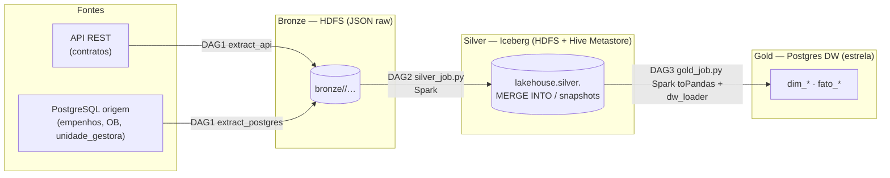
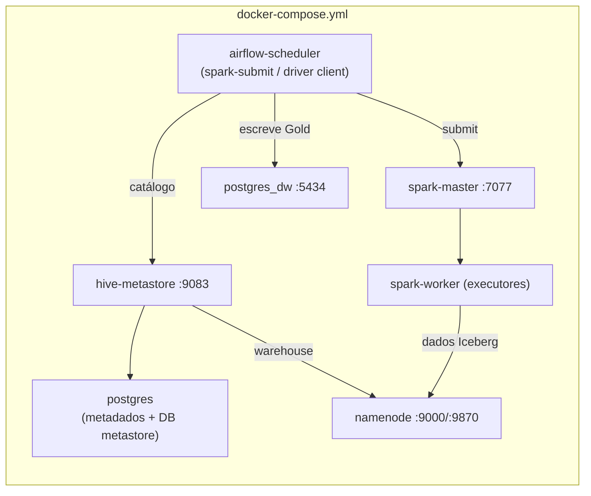

# Lakehouse — Spark + Apache Iceberg + HDFS (catálogo Hive Metastore)

Última atualização: 22/07/2026.

## Por que / o que muda

Antes, a Silver era **Parquet solto em HDFS** escrito por `pandas.to_parquet` —
um *data lake*, sem table format, sem ACID, sem time travel, e com o cluster
Hadoop servindo só de storage (compute 100% pandas single-node). A Silver passa
a ser **tabelas Apache Iceberg gerenciadas sobre o HDFS**, processadas por um
**cluster Spark standalone** e catalogadas por um **Hive Metastore** — um
*lakehouse*. Ganhos:

- **ACID + snapshots/time travel** — auditável (relevante para gasto público:
  "como estava o dado nesta data?").
- **Dedup entre execuções** via `MERGE INTO` — corrige a limitação documentada em
  `silver_transformer._dedup` (só deduplica dentro de uma execução) e remove a
  necessidade do `drop_duplicates` defensivo do `dw_loader`.
- **Schema/partition evolution** geridos pelo Iceberg.
- O Hadoop finalmente é usado para **compute** (Spark), não só storage.

**Não muda:** a **Bronze** continua raw (JSON via WebHDFS, DAG 1 intacta — best
practice de medalhão). A **Gold** continua sendo o Postgres DW dimensional; a
lógica de `sql/ddl_dw.sql` e de `src/loaders/dw_loader.py` é reaproveitada intacta.

## Arquitetura





## Matriz de versões (jars embutidos nas imagens — nada via `--packages`)

| Componente | Versão | Observação |
|---|---|---|
| Spark | 3.5.3 (Scala 2.12, Java 17) | client Hadoop 3.3 compatível com HDFS 3.2.1 |
| Iceberg | `iceberg-spark-runtime-3.5_2.12` 1.6.1 | fat jar, inclui suporte a HiveCatalog |
| Postgres JDBC | 42.7.4 | HMS -> Postgres e driver do DW |
| Hive Metastore | `apache/hive:4.0.0` (modo `metastore`) | backing store: Postgres DB `metastore` |
| Airflow | 2.9.1 + provider `apache-airflow-providers-apache-spark` 4.8.1 + `pyspark` 3.5.3 | client Spark (spark-submit + jars) |

> **Egress:** o host só tem saída IPv6 (ver `workaround-egress-ipv4-api.md`). Os
> builds usam `network: host`, e Maven Central/PyPI atendem por IPv6. **Fallback
> offline:** se o `curl`/`pip` do build falhar, pré-baixe os jars
> (`iceberg-spark-runtime-3.5_2.12-1.6.1.jar`, `postgresql-42.7.4.jar`) e troque o
> `curl` por `COPY` nos `docker/spark/Dockerfile`, `docker/hive/Dockerfile` e
> `docker/airflow/Dockerfile`.

## Configuração Iceberg/HMS/HDFS

Centralizada em `src/spark_jobs/spark_session.py` (`build_session`):

```
spark.sql.extensions               = org.apache.iceberg.spark.extensions.IcebergSparkSessionExtensions
spark.sql.catalog.lakehouse        = org.apache.iceberg.spark.SparkCatalog
spark.sql.catalog.lakehouse.type   = hive
spark.sql.catalog.lakehouse.uri    = thrift://hive-metastore:9083
spark.sql.catalog.lakehouse.warehouse = hdfs://namenode:9000/warehouse
spark.hadoop.fs.defaultFS          = hdfs://namenode:9000
```
Tabelas: `lakehouse.silver.<fonte>`, particionadas por `(ano, mes)` — exceto
`unidade_gestora`, só por `ano` (tabela de referência, sem coluna de data). As
constantes de campos-de-data / partição / chave de dedup são compartilhadas com o
caminho pandas em `src/transformers/rules.py`.

## Jobs Spark

- **`src/spark_jobs/silver_job.py --run-date YYYY-MM-DD`** — lê a Bronze JSON
  (multiline, filtrando por `data_extracao`), normaliza (datas + CNPJ/CPF em
  contratos) via expressões de coluna, deriva `ano`/`mes`, deduplica o lote pela
  chave de negócio e faz **`MERGE INTO`** na tabela Iceberg (upsert + dedup entre
  execuções). Na primeira carga, cria a tabela particionada.
- **`src/spark_jobs/gold_job.py`** — lê `lakehouse.silver.*` via Spark, `toPandas`,
  e injeta em `dw_loader.load_dw(read_source_fn=...)` — a mesma orquestração
  dimensões->fatos, agora sobre o Iceberg.

Submetidos pelas DAGs 2 e 3 (`SparkSubmitOperator`, `deploy_mode=client`). Em
client mode o **driver roda no `airflow-scheduler`** (por isso `spark.driver.host=
airflow-scheduler` no `conf` — ver `dags/common.py`), e os executores rodam no
`spark-worker`. Como não há UDF Python (só expressões de coluna), os executores
não precisam do nosso código Python.

## Runbook

```bash
# 1. Build + subir tudo
docker compose build          # baixa jars/pyspark (network: host)
docker compose up -d

# 2. Hive Metastore: o DB `metastore` só é criado automaticamente em volume novo
#    do Postgres. Se o volume já existia, crie manualmente e reinicie o HMS:
docker exec -it datalab_postgres psql -U dlab -d datalab \
  -c "CREATE USER hive WITH PASSWORD 'hive';" \
  -c "CREATE DATABASE metastore OWNER hive;"
docker compose up -d --force-recreate hive-metastore
docker logs -f datalab_hive_metastore   # esperar "Started ... metastore ... 9083"

# 3. Silver (usa a Bronze já existente no HDFS). Via Airflow: destrave a DAG
#    silver_transform. Ou manual (local[*] dentro do master, usa jars/env do
#    container):
docker exec -it datalab_spark_master /opt/spark/bin/spark-submit \
  /opt/datalab/src/spark_jobs/silver_job.py --run-date 2026-07-19

# 4. Validar Iceberg + PROVA DE TIME TRAVEL
docker exec -it datalab_spark_master /opt/spark/bin/spark-sql \
  --conf spark.sql.extensions=org.apache.iceberg.spark.extensions.IcebergSparkSessionExtensions \
  --conf spark.sql.catalog.lakehouse=org.apache.iceberg.spark.SparkCatalog \
  --conf spark.sql.catalog.lakehouse.type=hive \
  --conf spark.sql.catalog.lakehouse.uri=thrift://hive-metastore:9083 \
  --conf spark.sql.catalog.lakehouse.warehouse=hdfs://namenode:9000/warehouse \
  -e "SELECT count(*) FROM lakehouse.silver.empenhos;
      SELECT committed_at, snapshot_id FROM lakehouse.silver.empenhos.snapshots;"

# 5. Gold: destrave a DAG gold_load, ou manual:
docker exec -it datalab_spark_master /opt/spark/bin/spark-submit \
  /opt/datalab/src/spark_jobs/gold_job.py
# conferir no DW (porta 5434):
docker exec -it datalab_postgres_dw psql -U dw_user -d ceara_dw \
  -c "SELECT count(*) FROM dw.fato_contrato; SELECT count(*) FROM dw.fato_empenho;"

# 6. Ponta a ponta via Airflow: DAG1 (bronze) -> DAG2 (silver) -> DAG3 (gold),
#    encadeadas por Dataset. (extract_api depende do relay IPv4 — ver workaround.)
```

## Riscos / troubleshooting

- **Wiring de versões/classpath** é o maior risco — a validação ponta a ponta
  acontece com o cluster no ar. Se o `MERGE`/catálogo falhar, confira que o jar do
  Iceberg está no driver (`/opt/spark-extra-jars/` na imagem do Airflow, via
  `spark.jars`) e nos executores (`/opt/spark/jars/` na imagem do Spark).
- **Hive Metastore** é a peça mais sensível a ambiente: exige o DB `metastore` no
  Postgres e o schema inicializado (o entrypoint faz `schematool -initSchema`
  idempotente). Se o HMS não subir, quase sempre é o DB inexistente (passo 2) ou o
  driver JDBC ausente no classpath do Hive.
- **client mode / rede**: se os executores não reconectarem ao driver, confirme
  `spark.driver.host=airflow-scheduler` e que scheduler, master e worker estão na
  mesma rede do compose.
- **Windows**: tudo roda em containers Linux — nunca rodar Spark no host (evita
  winutils).

## Caminho pandas legado

`src/transformers/silver_transformer.py`, `silver_storage.py` e o `read_source`
(Parquet) **permanecem** para o backend `local` (dev) e para os testes unitários,
mas **não** são usados pelo pipeline HDFS/Iceberg. As regras compartilhadas ficam
em `src/transformers/rules.py`, importadas tanto pelo caminho pandas quanto pelo
`silver_job.py`.
